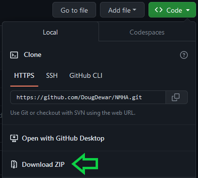
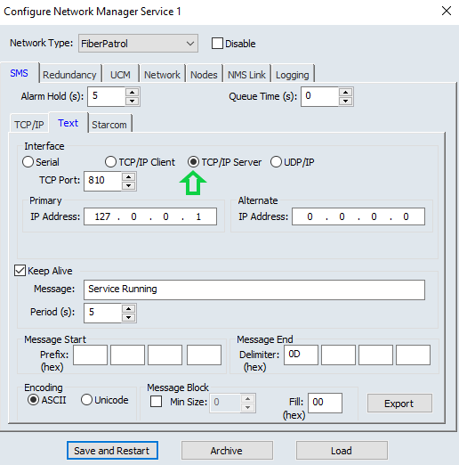
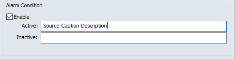
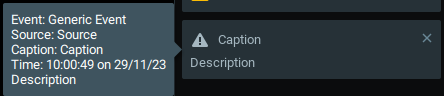
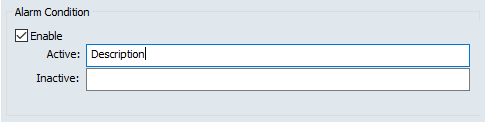
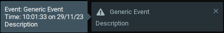
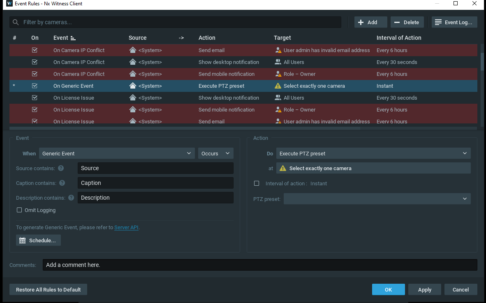
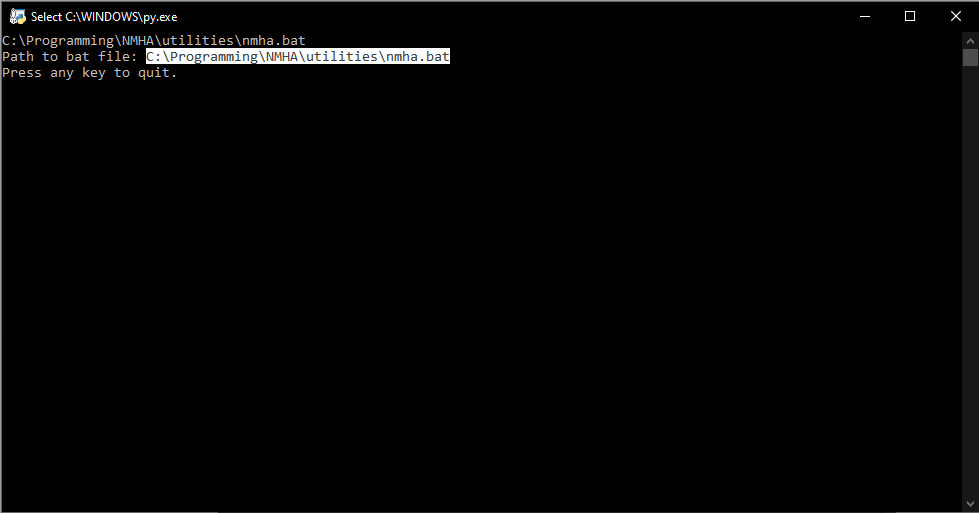
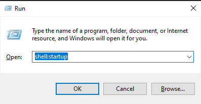
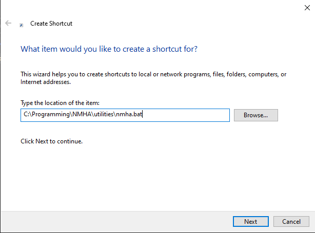

# Network Manager to HTTP Adapter

A simple script which forwards the events sent over Senstar NMS TCP/IP sockets to the http API of Network Optix Witness VMS (or related products).

## Description

The Network Manager to HTTP Adapter (NMHA) takes the messages sent over NMS sockets, attempts to format them to take advantage of Witness' event rules filters, then sends them to Witness using Witness' built-in API. This documentation assumes you are using Witness as the VMS, but it should work for rebranded versions of Witness such as Wisenet Wave or Digital Watchdog Spectrum.

## Getting Started

### Dependencies

* Requires python 3 with the requests library installed.
* Windows 10+

### Setting up

* Visit [python.org](https://www.python.org/) and install the latest version of python 3.
* Open the Windows command prompt and type:
```
pip install requests
```
* Download the script and config files by clicking "Code" and then "Download ZIP".\

* Extract the ZIP and move the files wherever you would like to run them from.
* Modify the fields in the config.ini file to match your existing setup.
* The fields in the config.ini are as follows:
    * [WITNESS] username: This is the username for an existing Witness profile that you wish to use to login to Witness. DEFAULT: admin
    * [WITNESS] password: This is the password for the same Witness profile. There is no default entry.
    * [WITNESS] ip: This the ip for the existing Witness server. If this script is running on the same machine, it can remain localhost, otherwise it should be the numbered address (e.g 127.0.0.1). DEFAULT: localhost
    * [WITNESS] port: This is the port for the same Witness server. The default Witness port is 7001. DEFAULT: 7001
    * [NMS] ip: This the ip for the existing NMS server. If this script is running on the same machine, it can remain localhost, otherwise it should be the numbered address (e.g 127.0.0.1). DEFAULT: localhost
    * [NMS] port: This is the port for the same NMS server. The default NMS port is 810. DEFAULT: 810
    * [LOGS] path: This is the path, which can be relative or absolute, for the folder where the logs will be stored. DEFAULT: logs
    * [LOGS] days: This is the number of days for which a given log will be stored before being automatically deleted. DEFAULT: 30

### Executing program

#### Setting up NMS
* The NMHA will only work with NMS if NMS is set to TCP/IP Server, like so:\


#### Creating NMS Alarms
* The NMHA tries to forward NMS events formatted with 3 fields (plus a timestamp): a source, a caption, and a description. To utilize this NMS alarms must be written in a specific format. The format is as follows:
    * SOURCE-CAPTION-DESCRIPTION
* Replace each word with the relevant information, maintaining the dashes seperating each field. If the alarm text does not contain exactly 2 dashes, the script will write the entire entry into the description field, leaving the source and caption blank.
* For example, this:\

* Will appear like this in Witness:\

* While this:\

* Will appear like this:\


#### Creating Witness Events Rules
* From there you can use these 3 fields to determine the course of action Witness will take in the "Event Rules Menu.\

* Remember Witness requires all 3 fields to be considered a match for the action to be taken. Witness only needs to match 1 of the words in a given field  to consider that field a match, and an empty field is automatically considered a match.

#### Running
* Ideally the NMHA will be run once both the Witness and NMS servers are live, but it should be to handle being started before either.
* To run the script you must have installed python and imported the requests modules.
* Assuming you have done this, you can simply double-click the script to run it, or run it from a terminal like so:
```
python <PATH>/nmha.py
```

#### Add to Startup
* If you wish to run the script on startup, you can do so using the Windows start up folder by following these steps:
    * Once the NHMA folder is in it's desired location, run the script located in the "utilities" folder called "create_startup_bat.py".
    * Before closing the "create_startup_bat.py" program, copy the path to the newly created bat file.\
    
    * Next press the Windows key plus "R" at the same time in order to open the "Run" window.
    * Type "shell:startup" in textbox.\
    
    * Windows will open a folder called "Startup", right-click in the folder and select "New -> Shortcut".
    * When Windows prompts you for the path to the program to be run, paste the path copied from the "create_startup_bat.py" program.\
    
    * Click "Next", followed by "Finish" and you should see a shortcut to a file called "nmha.bat". This means you have successfully added the program to startup.
* Note: If you ever move or rename NMHA folder you will have to repeat this process to re-add it to startup.

## Authors

Doug Dewar

## Version History

* 0.2
    * Updated the documentation and added a license for release.
* 0.1
    * Initial commit

## License

This project is licensed under the MIT License - see the [LICENSE.md](LICENSE.md) file for details